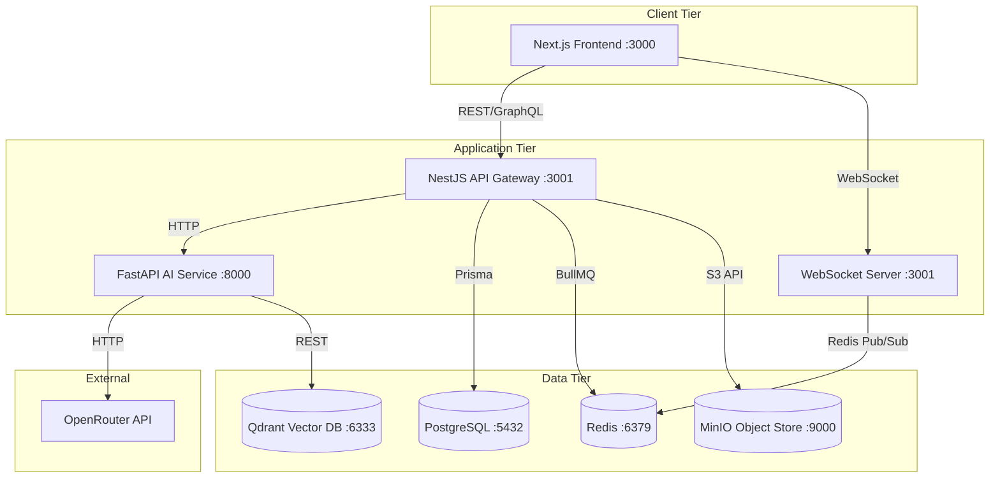
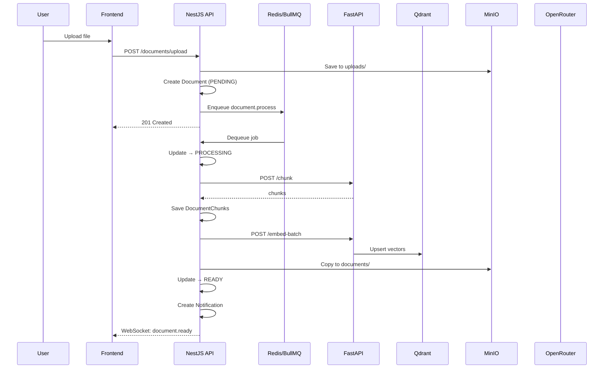
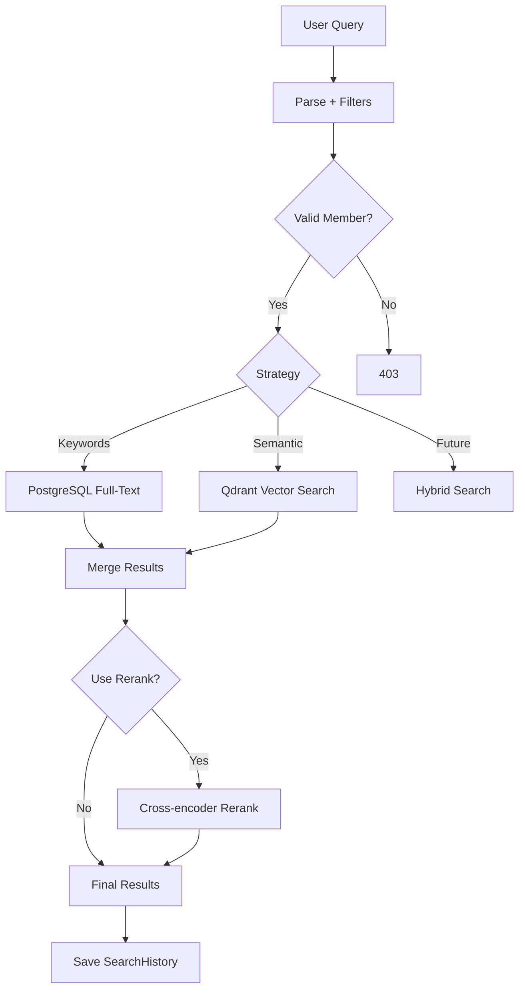
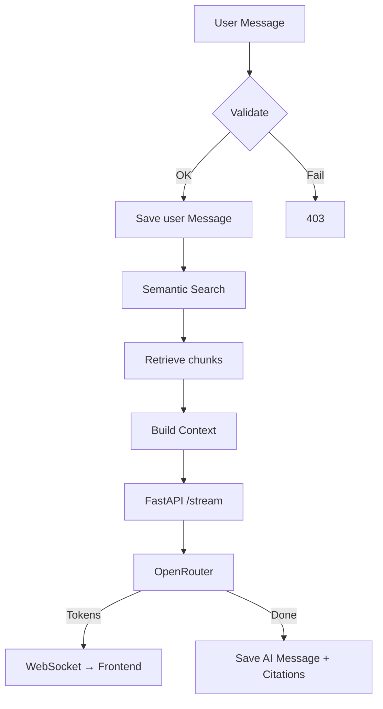
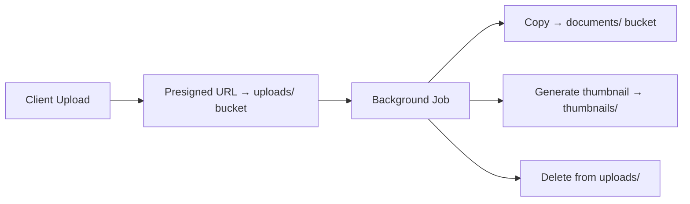
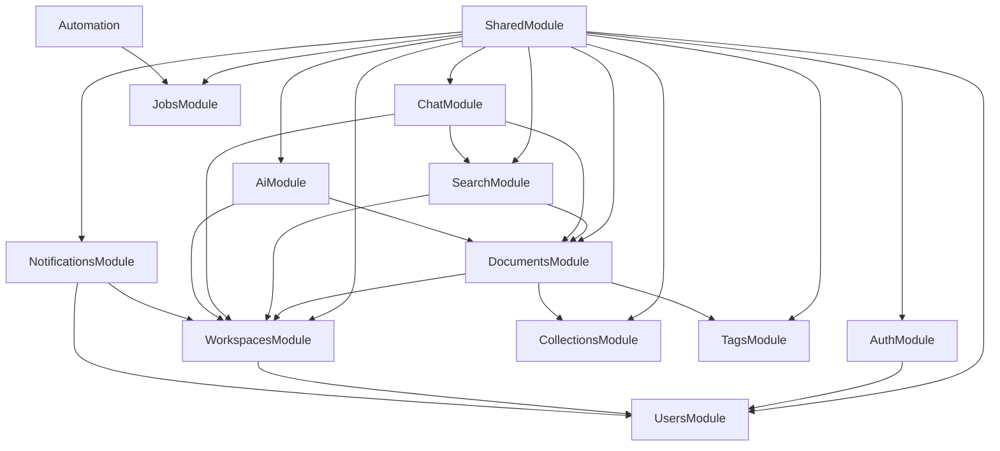

# AI Second Brain — Architecture Blueprint

> Phase 2 deliverable. Single source of truth for all implementation phases.

---

## Table of Contents

1. [Feature Map](#1-feature-map)
2. [Domain Model](#2-domain-model)
3. [Entity Relationships](#3-entity-relationships)
4. [Database Design](#4-database-design)
5. [Vector Database Design](#5-vector-database-design)
6. [File Storage Design](#6-file-storage-design)
7. [Backend Module Ownership](#7-backend-module-ownership)
8. [AI Service Responsibilities](#8-ai-service-responsibilities)
9. [Background Job Architecture](#9-background-job-architecture)
10. [Search Architecture](#10-search-architecture)
11. [Chat & RAG Architecture](#11-chat--rag-architecture)
12. [API Design](#12-api-design)
13. [Permissions Model](#13-permissions-model)
14. [Development Roadmap](#14-development-roadmap)
15. [Architecture Diagrams](#15-architecture-diagrams)

---

## 1. Feature Map

### Module: Authentication & Users

| Feature                           | Priority       | Description                                 |
| --------------------------------- | -------------- | ------------------------------------------- |
| Email/password registration       | **MVP**        | Standard sign-up with email, password, name |
| JWT login with refresh tokens     | **MVP**        | Access + refresh token flow                 |
| Profile management                | **MVP**        | Name, avatar, bio                           |
| Email verification                | **Future**     | Verify email with link                      |
| Password reset                    | **Future**     | Forgot/reset password flow                  |
| OAuth (Google, GitHub, Microsoft) | **Future**     | Social login                                |
| MFA / TOTP                        | **Enterprise** | Multi-factor auth                           |
| SSO / SAML                        | **Enterprise** | Single sign-on for orgs                     |
| SCIM provisioning                 | **Enterprise** | User lifecycle automation                   |

### Module: Workspaces

| Feature                             | Priority       | Description                  |
| ----------------------------------- | -------------- | ---------------------------- |
| Workspace CRUD                      | **MVP**        | Create, read, update, delete |
| Slug-based workspace URLs           | **MVP**        | `/{slug}` routing            |
| Member management (add/remove/role) | **MVP**        | Invite members with roles    |
| Email invitations                   | **MVP**        | Invite link via email        |
| Workspace settings                  | **MVP**        | AI model, chunking config    |
| Usage analytics dashboard           | **Future**     | Storage, queries, members    |
| Cross-workspace admin console       | **Enterprise** | Manage all workspaces        |

### Module: Knowledge Management

| Feature                             | Priority       | Description                   |
| ----------------------------------- | -------------- | ----------------------------- |
| Collections (knowledge base groups) | **MVP**        | Top-level organization        |
| Folders (hierarchical)              | **MVP**        | Nested folder structure       |
| Document CRUD                       | **MVP**        | Create, rename, move, delete  |
| PDF upload & processing             | **MVP**        | Text extraction, chunking     |
| DOCX upload & processing            | **MVP**        | Text extraction, chunking     |
| Markdown upload & processing        | **MVP**        | Direct rendering              |
| Image upload & OCR                  | **MVP**        | OCR text extraction           |
| Website import                      | **MVP**        | Crawl, extract, store         |
| GitHub repo import                  | **MVP**        | Clone, parse, store           |
| YouTube transcript import           | **MVP**        | Fetch transcript, store       |
| Tag management                      | **MVP**        | Create, assign, filter        |
| Bulk import/export                  | **Future**     | Multiple files at once        |
| Document linking                    | **Future**     | Cross-document references     |
| Custom metadata schemas             | **Enterprise** | Per-workspace metadata fields |

### Module: AI

| Feature                | Priority       | Description                   |
| ---------------------- | -------------- | ----------------------------- |
| Text chunking          | **MVP**        | Recursive character splitting |
| Embedding generation   | **MVP**        | Vector embeddings             |
| RAG-powered chat       | **MVP**        | Ask questions over knowledge  |
| Document summarization | **MVP**        | AI-generated summaries        |
| Flashcard generation   | **Future**     | Study flashcards from content |
| Quiz generation        | **Future**     | Test questions from content   |
| Note generation        | **Future**     | Condensed notes               |
| Translation            | **Future**     | Cross-language support        |
| Mind map generation    | **Future**     | Visual knowledge maps         |
| Custom AI models       | **Enterprise** | Own model endpoints           |
| AI agent workflows     | **Enterprise** | Multi-step autonomous tasks   |

### Module: Search

| Feature                          | Priority   | Description                    |
| -------------------------------- | ---------- | ------------------------------ |
| Semantic search                  | **MVP**    | Vector similarity search       |
| Keyword search                   | **MVP**    | PostgreSQL full-text           |
| Metadata filtering               | **MVP**    | By collection, tag, type, date |
| Workspace-scoped search          | **MVP**    | Isolation by workspace         |
| Citation generation              | **MVP**    | Source references in results   |
| Search history                   | **MVP**    | Recent queries                 |
| Hybrid search (vector + keyword) | **Future** | BM25 + dense vector fusion     |
| Reranking                        | **Future** | Cross-encoder reranking        |

### Module: Chat

| Feature                     | Priority   | Description                  |
| --------------------------- | ---------- | ---------------------------- |
| Per-workspace conversations | **MVP**    | Chat scoped to workspace     |
| AI chat with context        | **MVP**    | RAG over workspace documents |
| Streaming responses         | **MVP**    | Real-time token streaming    |
| Message history             | **MVP**    | Scrollable conversation      |
| Source citations            | **MVP**    | Clickable source references  |
| Message feedback (thumbs)   | **MVP**    | Rate responses               |
| Multi-modal chat (images)   | **Future** | Upload images in chat        |
| Prompt templates            | **Future** | Saved prompt presets         |

### Module: Collaboration & Sharing

| Feature                         | Priority       | Description                      |
| ------------------------------- | -------------- | -------------------------------- |
| Share document links            | **MVP**        | Shareable links with permissions |
| Comments on documents           | **Future**     | Threaded comments                |
| Share collections               | **Future**     | Share entire collections         |
| Real-time collaborative editing | **Enterprise** | Multi-user editing               |

### Module: Notifications

| Feature                | Priority   | Description                   |
| ---------------------- | ---------- | ----------------------------- |
| In-app notifications   | **MVP**    | Bell icon, notification panel |
| Document-ready alerts  | **MVP**    | Notify when processing done   |
| WebSocket push         | **MVP**    | Real-time delivery            |
| Email notifications    | **Future** | Digest emails                 |
| Slack/Discord webhooks | **Future** | External integrations         |

### Module: Settings & Administration

| Feature                   | Priority       | Description               |
| ------------------------- | -------------- | ------------------------- |
| User preferences          | **MVP**        | Theme, language           |
| Workspace configuration   | **MVP**        | AI model, chunking params |
| API key management        | **MVP**        | Create/revoke keys        |
| Audit log                 | **MVP**        | Track changes             |
| Background job monitoring | **MVP**        | Job status, retry         |
| Global admin panel        | **Enterprise** | All-workspace oversight   |
| Billing & quotas          | **Enterprise** | Usage-based billing       |

---

## 2. Domain Model

### Core Entities

#### User

| Attribute            | Value                                                                             |
| -------------------- | --------------------------------------------------------------------------------- |
| **Purpose**          | Represents a registered person in the system                                      |
| **Responsibilities** | Authentication, owns conversations, receives notifications, belongs to workspaces |
| **Owner**            | AuthModule / UsersModule                                                          |
| **Lifecycle**        | Created on registration → Active → Suspended → Soft-deleted                       |

#### Workspace

| Attribute            | Value                                                             |
| -------------------- | ----------------------------------------------------------------- |
| **Purpose**          | Top-level isolation boundary. All data lives within a workspace   |
| **Responsibilities** | Contains members, collections, documents, conversations, settings |
| **Owner**            | WorkspacesModule                                                  |
| **Lifecycle**        | Created by user → Active → Soft-deleted (cascades all content)    |

#### WorkspaceMember

| Attribute            | Value                                              |
| -------------------- | -------------------------------------------------- |
| **Purpose**          | Links a User to a Workspace with a role            |
| **Responsibilities** | Determines what a user can do in a workspace       |
| **Owner**            | WorkspacesModule                                   |
| **Lifecycle**        | Created on invite/join → Role may change → Removed |

#### Collection

| Attribute            | Value                                           |
| -------------------- | ----------------------------------------------- |
| **Purpose**          | Top-level knowledge grouping within a workspace |
| **Responsibilities** | Organizes documents into named groups           |
| **Owner**            | CollectionsModule                               |
| **Lifecycle**        | Created → Updated → Soft-deleted                |

#### Folder

| Attribute            | Value                                                 |
| -------------------- | ----------------------------------------------------- |
| **Purpose**          | Hierarchical document organization within a workspace |
| **Responsibilities** | Self-referencing tree structure for nesting           |
| **Owner**            | CollectionsModule                                     |
| **Lifecycle**        | Created → Moved → Renamed → Soft-deleted              |

#### Document

| Attribute            | Value                                                             |
| -------------------- | ----------------------------------------------------------------- |
| **Purpose**          | Core knowledge artifact. Represents any imported piece of content |
| **Responsibilities** | Owns versions, chunks, tags, citations, AI-generated content      |
| **Owner**            | DocumentsModule                                                   |
| **Lifecycle**        | PENDING_UPLOAD → PROCESSING → READY / FAILED → Soft-deleted       |

#### DocumentVersion

| Attribute            | Value                                               |
| -------------------- | --------------------------------------------------- |
| **Purpose**          | Immutable snapshot of a document at a point in time |
| **Responsibilities** | Points to file in MinIO, stores version metadata    |
| **Owner**            | DocumentsModule                                     |
| **Lifecycle**        | Created on update. Never modified.                  |

#### DocumentChunk

| Attribute            | Value                                                                        |
| -------------------- | ---------------------------------------------------------------------------- |
| **Purpose**          | A piece of document content used for embedding and search                    |
| **Responsibilities** | Stores extracted text, position info, citation links                         |
| **Owner**            | DocumentsModule                                                              |
| **Lifecycle**        | Created during processing → Replaced on reprocessing → Deleted with document |

#### Tag

| Attribute            | Value                                          |
| -------------------- | ---------------------------------------------- |
| **Purpose**          | Lightweight classification label for documents |
| **Responsibilities** | Many-to-many relationship with documents       |
| **Owner**            | TagsModule                                     |
| **Lifecycle**        | Created → Used → Deleted                       |

#### Conversation

| Attribute            | Value                                             |
| -------------------- | ------------------------------------------------- |
| **Purpose**          | A chat session between a user and the AI          |
| **Responsibilities** | Groups messages, tracks workspace context         |
| **Owner**            | ChatModule                                        |
| **Lifecycle**        | Created on first message → Updated → Soft-deleted |

#### Message

| Attribute            | Value                                                     |
| -------------------- | --------------------------------------------------------- |
| **Purpose**          | A single exchange in a conversation (user or AI)          |
| **Responsibilities** | Stores content, role, feedback, and links to citations    |
| **Owner**            | ChatModule                                                |
| **Lifecycle**        | Created on send/receive → Optionally feedback given later |

#### Citation

| Attribute            | Value                                                                  |
| -------------------- | ---------------------------------------------------------------------- |
| **Purpose**          | Links an AI message back to the source document chunk that informed it |
| **Responsibilities** | Enables source attribution for AI responses                            |
| **Owner**            | ChatModule                                                             |
| **Lifecycle**        | Created with AI message → Deleted with message                         |

#### BackgroundJob

| Attribute            | Value                                           |
| -------------------- | ----------------------------------------------- |
| **Purpose**          | Tracks asynchronous processing jobs             |
| **Responsibilities** | Reports status, progress, errors                |
| **Owner**            | JobsModule                                      |
| **Lifecycle**        | Created → Waiting → Active → Completed / Failed |

#### AuditLog

| Attribute            | Value                                           |
| -------------------- | ----------------------------------------------- |
| **Purpose**          | Immutable record of user actions in a workspace |
| **Responsibilities** | Stores who did what, when, and from where       |
| **Owner**            | All modules (cross-cutting)                     |
| **Lifecycle**        | Created once, never modified, never deleted     |

#### APIKey

| Attribute            | Value                                       |
| -------------------- | ------------------------------------------- |
| **Purpose**          | API access credentials for programmatic use |
| **Responsibilities** | Allows API access with scoped permissions   |
| **Owner**            | WorkspacesModule                            |
| **Lifecycle**        | Created → Active → Revoked                  |

### New Entities

#### File

| Attribute            | Value                                                                             |
| -------------------- | --------------------------------------------------------------------------------- |
| **Purpose**          | Tracks uploaded files during the processing pipeline before they become Documents |
| **Responsibilities** | Stores temp MinIO key, original name, size, mime type, processing status          |
| **Owner**            | DocumentsModule                                                                   |
| **Lifecycle**        | Created on upload → Processing → Attached to version / Failed                     |

#### DocumentImport

| Attribute            | Value                                                      |
| -------------------- | ---------------------------------------------------------- |
| **Purpose**          | Records metadata about how a document was imported         |
| **Responsibilities** | Stores source URL, import type, and type-specific metadata |
| **Owner**            | DocumentsModule                                            |
| **Lifecycle**        | Created with Document on import → Persisted                |

#### GeneratedContent

| Attribute            | Value                                                          |
| -------------------- | -------------------------------------------------------------- |
| **Purpose**          | Stores AI-generated assets linked to a document                |
| **Responsibilities** | Holds content as JSON with type discriminator                  |
| **Owner**            | AiModule                                                       |
| **Lifecycle**        | Created by AI job → May be regenerated → Deleted with document |

#### Notification

| Attribute            | Value                                        |
| -------------------- | -------------------------------------------- |
| **Purpose**          | Delivers information to users about events   |
| **Responsibilities** | Stored in DB, delivered in-app via WebSocket |
| **Owner**            | NotificationsModule                          |
| **Lifecycle**        | Created → Unread → Read → Auto-pruned        |

#### SearchHistory

| Attribute            | Value                                             |
| -------------------- | ------------------------------------------------- |
| **Purpose**          | Logs user search queries for analytics and recall |
| **Responsibilities** | Stores query, filters, result count               |
| **Owner**            | SearchModule                                      |
| **Lifecycle**        | Created on search → Auto-pruned                   |

#### UserSettings

| Attribute            | Value                                      |
| -------------------- | ------------------------------------------ |
| **Purpose**          | User-level preferences                     |
| **Responsibilities** | Stores theme, language, notification prefs |
| **Owner**            | UsersModule                                |
| **Lifecycle**        | Created with user → Updated by user        |

#### WorkspaceSettings

| Attribute            | Value                                               |
| -------------------- | --------------------------------------------------- |
| **Purpose**          | Workspace-level AI and behavior configuration       |
| **Responsibilities** | AI model selection, chunking parameters, max tokens |
| **Owner**            | WorkspacesModule                                    |
| **Lifecycle**        | Created with workspace → Updated by admin           |

#### Comment

| Attribute            | Value                                        |
| -------------------- | -------------------------------------------- |
| **Purpose**          | User comments on documents for collaboration |
| **Responsibilities** | Supports threading via parentId              |
| **Owner**            | DocumentsModule                              |
| **Lifecycle**        | Created → Edited → Soft-deleted              |

#### SharedLink

| Attribute            | Value                                                  |
| -------------------- | ------------------------------------------------------ |
| **Purpose**          | Token-based sharing of documents outside the workspace |
| **Responsibilities** | Provides time-limited access with specific permissions |
| **Owner**            | DocumentsModule                                        |
| **Lifecycle**        | Created → Active → Expired / Revoked                   |

---

## 3. Entity Relationships

### Visual Map

```
User ──1:N── WorkspaceMember ──N:1── Workspace
User ──1:1── UserSettings
User ──1:N── Conversation (creator)
User ──1:N── Message (sender)
User ──1:N── Notification
User ──1:N── AuditLog (actor)
User ──1:N── File (uploader)

Workspace ──1:N── Collection
Workspace ──1:N── Folder (tree via parentId)
Workspace ──1:N── Document
Workspace ──1:N── Tag
Workspace ──1:N── Conversation
Workspace ──1:N── APIKey
Workspace ──1:N── WorkspaceInvitation
Workspace ──1:N── BackgroundJob
Workspace ──1:N── AuditLog
Workspace ──1:N── Notification
Workspace ──1:1── WorkspaceSettings

Collection ──1:N── Document (nullable FK, onDelete: SetNull)
Folder ──1:N── Document (nullable FK, onDelete: SetNull)
Folder ──1:N── Folder (self-referencing, onDelete: Cascade)

Document ──1:N── DocumentVersion
DocumentVersion ──1:N── DocumentChunk
Document ──N:M── Tag (implicit join table)
Document ──1:N── GeneratedContent
Document ──1:N── DocumentImport
Document ──1:N── Comment
Document ──1:N── File
Document ──1:N── SharedLink

Conversation ──1:N── Message
Message ──1:N── Citation
Citation ──N:1── DocumentChunk
```

### Key Design Rationale

| Relationship                       | Type           | Why                                                                                                             |
| ---------------------------------- | -------------- | --------------------------------------------------------------------------------------------------------------- |
| User : WorkspaceMember : Workspace | N:M via join   | A user can belong to many workspaces; a workspace has many users. The join table carries the role.              |
| User : UserSettings                | 1:1            | Each user has exactly one settings record. Private to the user.                                                 |
| Collection : Document              | 1:N (nullable) | A document optionally belongs to a collection. Collection deletion does not cascade-delete documents (SetNull). |
| Folder : Document                  | 1:N (nullable) | Same soft-delete strategy as Collection.                                                                        |
| Document : Tag                     | N:M            | Documents can have multiple tags; tags can apply to many documents. Prisma implicit join table handles this.    |
| Document : DocumentVersion         | 1:N            | Each update to a document creates a new immutable version.                                                      |
| DocumentVersion : DocumentChunk    | 1:N            | Each version is split into chunks. Chunks are the atomic unit for embeddings.                                   |
| Document : GeneratedContent        | 1:N            | A document can have multiple AI-generated artifacts (summary + flashcards + notes).                             |
| Message : Citation                 | 1:N            | An AI message can cite multiple chunks from different documents.                                                |
| Citation : DocumentChunk           | N:1            | Many citations can reference the same chunk across different conversations.                                     |
| User : Notification                | 1:N            | A user receives many notifications, scoped to workspace.                                                        |

---

## 4. Database Design

All models are defined in `apps/api/prisma/schema.prisma`. This section documents the complete schema design.

### Enums

```prisma
enum UserRole { OWNER ADMIN EDITOR MEMBER VIEWER }
enum UserStatus { ACTIVE SUSPENDED DELETED }
enum DocStatus { PENDING_UPLOAD PROCESSING READY FAILED }
enum ImportType { FILE WEBSITE GITHUB YOUTUBE }
enum JobStatus { WAITING ACTIVE COMPLETED FAILED RETRYING }
enum FileStatus { TEMP PROCESSING PERSISTED FAILED }
enum GeneratedContentType { SUMMARY FLASHCARD QUIZ NOTES MINDMAP }
enum NotificationType {
  DOCUMENT_READY IMPORT_COMPLETE SUMMARY_READY
  MEMBER_JOINED MEMBER_LEFT COMMENT_ADDED
  DOCUMENT_SHARED JOB_FAILED
}
```

### Models

**User** — id, email (unique), passwordHash, name?, avatarUrl?, bio?, status, emailVerified, lastLogin?, createdAt, updatedAt, deletedAt?

**Workspace** — id, name, slug (unique), createdAt, updatedAt, deletedAt?

**WorkspaceMember** — id, workspaceId, userId, role, createdAt, updatedAt. Unique on [workspaceId, userId].

**WorkspaceInvitation** — id, workspaceId, email, role, token (unique), expiresAt, acceptedAt?, rejectedAt?, createdAt, updatedAt.

**APIKey** — id, workspaceId, name, keyHash (unique), scopes[], expiresAt?, createdAt, revokedAt?.

**Collection** — id, workspaceId, name, description?, createdAt, updatedAt, deletedAt?.

**Folder** — id, workspaceId, parentId? (self-ref), name, createdAt, updatedAt.

**Document** — id, workspaceId, collectionId?, folderId?, title, sourceType, status, createdAt, updatedAt, deletedAt?.

**DocumentVersion** — id, documentId, versionNumber, storageKey, fileName, fileSize (BigInt), mimeType, checksum, createdAt.

**DocumentChunk** — id, versionId, chunkIndex, pageNumber?, content, charStart, charEnd, metadata (Json), createdAt.

**Tag** — id, workspaceId, name, color, documents[] (M2M). Unique on [workspaceId, name].

**Conversation** — id, workspaceId, creatorId?, title, createdAt, updatedAt, deletedAt?.

**Message** — id, conversationId, senderId?, role, content, feedbackRating?, feedbackText?, createdAt.

**Citation** — id, messageId, chunkId, relevanceScore (Float), createdAt.

**BackgroundJob** — id, workspaceId, jobType, status, progress, errorMessage?, meta (Json), createdAt, updatedAt.

**AuditLog** — id, workspaceId, userId?, action, ipAddress?, details (Json), createdAt.

**File** — id, workspaceId, uploadedById?, documentId?, storageKey, originalName, fileSize (BigInt), mimeType, status (FileStatus), createdAt, updatedAt.

**DocumentImport** — id, documentId, importType, sourceUrl?, metadata (Json), createdAt. Unique on [documentId, importType].

**GeneratedContent** — id, documentId, type (GeneratedContentType), content (Json), model, createdBy?, createdAt.

**Notification** — id, workspaceId, userId, type (NotificationType), title, body?, data (Json), readAt?, createdAt.

**SearchHistory** — id, workspaceId, userId?, query, filters (Json), resultCount, createdAt.

**UserSettings** — id, userId (unique), theme, language, preferences (Json), createdAt, updatedAt.

**WorkspaceSettings** — id, workspaceId (unique), aiModel, embeddingModel, chunkSize, chunkOverlap, maxTokens, temperature, preferences (Json), createdAt, updatedAt.

**Comment** — id, documentId, userId, content, parentId?, createdAt, updatedAt, deletedAt?.

**SharedLink** — id, documentId, createdBy, token (unique), permission, expiresAt?, createdAt, lastAccessedAt?.

### Indexing Strategy

All foreign keys are indexed. Additional performance indexes:

- Document: `@@index([workspaceId, status])` — for workspace-scoped status filtering
- Document: `@@index([collectionId])` — collection-based queries
- WorkspaceMember: `@@index([role])` — role-based queries
- Message: `@@index([conversationId, createdAt])` — conversation message ordering
- BackgroundJob: `@@index([status, createdAt])` — job monitoring
- Notification: `@@index([userId, readAt])` — unread notification queries

### Soft Delete Strategy

Entities with `deletedAt`: User, Workspace, Collection, Document, Conversation, Comment.

- All queries filter `WHERE deletedAt IS NULL` via Prisma middleware
- Soft-deleted records can be restored or permanently purged after N days
- AuditLog is never deleted
- Message, Citation, DocumentChunk hard-delete with parent document

---

## 5. Vector Database Design (Qdrant)

### Collection Strategy

**Single collection**: `chunks`

Rationale: Simpler management, sufficient for expected scale. Workspace isolation via payload filtering.

### Collection Configuration

```
Collection: chunks
Vector size: 384 (configurable per workspace)
Distance: Cosine
HNSW: m=16, ef_construct=100
```

### Payload Structure

```json
{
  "workspace_id": "uuid",
  "document_id": "uuid",
  "version_id": "uuid",
  "chunk_id": "uuid",
  "chunk_index": 5,
  "page_number": null,
  "content_preview": "First 200 chars...",
  "document_title": "Strategic Planning 2026",
  "source_type": "FILE",
  "mime_type": "application/pdf",
  "collection_id": "uuid-or-null",
  "tags": ["finance", "planning"],
  "created_at": "2026-06-27T12:00:00Z",
  "content_length": 512
}
```

### Payload Indexes

Keyword indexes on: `workspace_id`, `document_id`, `collection_id`, `tags`, `source_type`

### Workspace Isolation

Every Qdrant query MUST include `workspace_id` filter. NestJS validates workspace membership before calling FastAPI. FastAPI enforces workspace_id in all queries.

### Embedding IDs

Point IDs: `"chunk_{chunk_uuid}"` — enables direct lookup, upsert, and deletion.

### Hybrid Search (Future)

Qdrant supports sparse vectors natively. When implemented, use `prefer_hybrid_search=True` with RRF fusion.

---

## 6. File Storage Design (MinIO)

### Buckets

| Bucket       | Visibility  | Versioning | Lifecycle             |
| ------------ | ----------- | ---------- | --------------------- |
| `uploads`    | Private     | Disabled   | Auto-delete after 24h |
| `documents`  | Private     | Enabled    | None                  |
| `thumbnails` | Public-read | Disabled   | None                  |
| `generated`  | Private     | Disabled   | None                  |

### Naming Convention

```
uploads/{workspaceId}/{userId}/{uuid}_{originalName}
documents/{workspaceId}/{documentId}/{versionNumber}/{uuid}_{fileName}
thumbnails/{workspaceId}/{documentId}/{versionNumber}/{uuid}_{size}.{ext}
generated/{workspaceId}/{documentId}/{type}/{uuid}_{fileName}
```

### Upload Flow

1. Client sends multipart POST → NestJS generates presigned URL → uploads/ bucket
2. Background job processes → copies to documents/
3. Uploads/ auto-deleted after 24h

### Security

- Presigned URLs for uploads (15min expiry) and downloads (1hr expiry)
- Thumbnails: public-read for direct browser rendering
- Application-level enforcement before returning presigned URLs

---

## 7. Backend Module Ownership

### Module Map

```
┌─────────────────────────────────────────────────────────────────┐
│                      SHARED MODULES                              │
│  SharedModule (Prisma, Storage, Cache, EventBus)                 │
│  JobsModule (BullMQ queues, consumers)                           │
├─────────────────────────────────────────────────────────────────┤
│                       CORE MODULES                               │
│  AuthModule (JWT, guards)                                        │
│  UsersModule (profiles, settings)                                │
│  WorkspacesModule (members, invitations, API keys, settings)     │
├─────────────────────────────────────────────────────────────────┤
│                      DOMAIN MODULES                              │
│  DocumentsModule (versions, chunks, files, imports)              │
│  CollectionsModule (collections, folders)                        │
│  TagsModule (tags, document-tag M2M)                             │
│  SearchModule (orchestrator, history)                            │
├─────────────────────────────────────────────────────────────────┤
│                      FEATURE MODULES                             │
│  ChatModule (conversations, messages, citations)                 │
│  AiModule (FastAPI HTTP client, generated content)               │
│  NotificationsModule (in-app, WebSocket push)                    │
│  AutomationModule (job triggers from events)                     │
└─────────────────────────────────────────────────────────────────┘
```

### Key Rules

1. No circular dependencies
2. No module directly accesses another module's Prisma models
3. Cross-module reads happen through exported Services
4. AuthModule is imported by all protected modules
5. SharedModule is imported by all modules

---

## 8. AI Service Responsibilities (FastAPI)

### What Belongs in FastAPI

| Endpoint                           | Purpose                              |
| ---------------------------------- | ------------------------------------ |
| `POST /api/v1/chunk`               | Recursive/semantic text splitting    |
| `POST /api/v1/embed`               | Single text embedding                |
| `POST /api/v1/embed-batch`         | Batch embedding for efficiency       |
| `POST /api/v1/search`              | Vector search in Qdrant with filters |
| `POST /api/v1/hybrid-search`       | Future: sparse + dense fusion        |
| `POST /api/v1/chat/completion`     | Non-streaming LLM chat               |
| `POST /api/v1/chat/stream`         | Streaming LLM chat (SSE)             |
| `POST /api/v1/generate/summary`    | Document summarization               |
| `POST /api/v1/generate/flashcards` | Flashcard generation                 |
| `POST /api/v1/generate/quiz`       | Quiz question generation             |
| `POST /api/v1/generate/notes`      | Note generation                      |
| `POST /api/v1/generate/mindmap`    | Mind map generation                  |
| `POST /api/v1/ocr`                 | OCR for images/scanned PDFs          |
| `POST /api/v1/classify`            | Auto-tagging / classification        |
| `POST /api/v1/rerank`              | Cross-encoder result reranking       |

### What Does NOT Belong in FastAPI

| Concern              | Location                | Rationale                |
| -------------------- | ----------------------- | ------------------------ |
| User auth            | NestJS AuthModule       | Business logic           |
| Permission checks    | NestJS Guards           | RBAC is business concern |
| Workspace membership | NestJS WorkspacesModule | Workspace logic          |
| Document CRUD        | NestJS DocumentsModule  | Document lifecycle       |
| Conversation storage | NestJS ChatModule       | Persistence              |
| Job orchestration    | NestJS JobsModule       | Queue management         |
| MinIO operations     | NestJS SharedModule     | Storage infrastructure   |
| Rate limiting        | NestJS ThrottlerModule  | Cross-cutting concern    |

### Communication Pattern

```
NestJS ←────── HTTP ──────→ FastAPI
  Request validation          Pure compute
  Permission checks           No DB access
  Data persistence            Vector store only
  Job orchestration           ML/NLP operations
```

### Prompt Template Management

Templates live in FastAPI:

```
prompts/
├── chat/
│   ├── system.txt
│   ├── rag_context.txt
│   └── citation.txt
├── generate/
│   ├── summary.txt
│   ├── flashcards.txt
│   ├── quiz.txt
│   └── notes.txt
└── classify/
    └── tags.txt
```

---

## 9. Background Job Architecture

### Queue Design

| Queue           | Jobs                             |
| --------------- | -------------------------------- |
| `documents`     | process, reprocess, delete       |
| `imports`       | website, github, youtube         |
| `ai-generation` | summary, flashcards, quiz, notes |
| `maintenance`   | reindex, cleanup, prune          |

### Document Processing Pipeline

```
Upload → Save to MinIO (uploads/) → Create Document (PENDING)
  → Enqueue "document.process"
  → Update status to PROCESSING
  → Extract text (FastAPI: OCR or parser)
  → Chunk text (FastAPI: /api/v1/chunk)
  → Save chunks to PostgreSQL
  → Embed chunks (FastAPI: /api/v1/embed-batch)
  → Store vectors in Qdrant
  → Move file to documents/ bucket
  → Update Document to READY
  → Create Notification (DOCUMENT_READY)
  → [Optional] Enqueue summary generation
```

### Retry Strategy

- Max 5 attempts with exponential backoff: 30s → 60s → 2m → 5m → 15m
- Each step is idempotent
- After max retries: mark FAILED with error message
- Manual retry available via admin API

### Job Types

- `document.process` — Main processing pipeline
- `document.generate-summary` — Generate summary after processing
- `document.reprocess` — Re-process (new chunking/embedding)
- `document.delete` — Cascade delete including Qdrant points
- `import.website` — Website crawling and import
- `import.github` — GitHub repo cloning and import
- `import.youtube` — YouTube transcript fetching and import
- `search.reindex` — Re-index search for a document/workspace

---

## 10. Search Architecture

### Three-Tier Strategy

**Tier 1: PostgreSQL Full-Text** — tsvector on Document.title + DocumentChunk.content. GIN indexes. Good for exact matches, proper nouns, fast lookups.

**Tier 2: Semantic Search (Qdrant)** — Vector similarity via FastAPI. Good for conceptual matches, synonyms, natural language queries.

**Tier 3: Hybrid Search (Future)** — Dense + sparse vectors fused via RRF.

### Metadata Filtering

| Filter        | Source                 | Applied At       |
| ------------- | ---------------------- | ---------------- |
| workspace_id  | Required (JWT context) | FastAPI → Qdrant |
| collection_id | Optional (query param) | FastAPI → Qdrant |
| tags          | Optional (query param) | FastAPI → Qdrant |
| source_type   | Optional (query param) | FastAPI → Qdrant |
| mime_type     | Optional (query param) | FastAPI → Qdrant |
| date range    | Optional (query param) | FastAPI → Qdrant |

### Reranking

Optional step using cross-encoder:

1. Initial search returns top-k (e.g., 20)
2. FastAPI `/api/v1/rerank` scores each (query, chunk) pair
3. Re-sort by reranker score
4. Return top N (e.g., 5)

### Citation Generation

- Citation table links Message → DocumentChunk
- Each citation stores: chunkId, documentId, relevanceScore, excerpt
- Frontend renders as numbered inline badges
- Clicking opens the source document at the specific page/chunk

### Permission Filtering

- workspace_id is a required search filter
- NestJS validates workspace membership before search
- Qdrant filters ensure only workspace chunks are searched

---

## 11. Chat & RAG Architecture

### Complete Flow

```
User Question
  → NestJS: validate workspace membership
  → NestJS: save user Message to DB
  → NestJS: semantic search via FastAPI
    → FastAPI: embed query → Qdrant search → return chunks
  → NestJS: fetch full chunk content from PostgreSQL
  → NestJS: build context (system prompt + RAG chunks + history + query)
  → FastAPI: call OpenRouter with constructed prompt (streaming)
  → FastAPI: stream tokens back to NestJS
  → NestJS: stream to Frontend via WebSocket
  → NestJS: save AI Message with citations to DB
  → Frontend: render streaming response with citation badges
```

### Context Construction

```
System: You are an AI assistant with access to the user's knowledge base.
Answer based on the provided context. Cite sources using [1], [2], etc.
If you cannot find the answer in the context, say so.

Context:
[1] Document: "Strategic Planning 2026" (page 12)
    Content: "The Q3 roadmap focuses on international expansion..."
[2] Document: "Annual Report" (page 45)
    Content: "Revenue grew 23% year-over-year in APAC..."

Conversation History:
User: What were our revenue trends last year?
Assistant: Based on the annual report [2], revenue grew 23%...

User: How does this affect our Q3 plans?
```

### Context Window Management

- Max tokens: configurable (default 8000 for GPT-4o)
- Reserve ~500 tokens for response
- Include: system prompt → context chunks (trimmed to fit) → history (oldest trimmed first) → current query
- Token counting via tiktoken (FastAPI)

### Streaming

WebSocket for full-duplex communication:

1. Client opens WS at `/ws/chat`
2. Authenticates via JWT
3. Sends `{ action: "chat", conversationId, content }`
4. Server streams `{ token: "Based", done: false }`
5. Server sends `{ done: true, messageId, citations }`

### Citation Display

```json
{
  "messageId": "msg_123",
  "content": "Based on [1], revenue grew 23% in APAC [2].",
  "citations": [
    {
      "number": 1,
      "documentId": "doc_456",
      "documentTitle": "Strategic Planning 2026",
      "pageNumber": 12,
      "excerpt": "The Q3 roadmap focuses...",
      "relevanceScore": 0.92
    }
  ]
}
```

---

## 12. API Design

### Conventions

- Base URL: `/api/v1`
- Plural nouns, lowercase, kebab-case
- UUIDs for all IDs
- Pagination: `?page=1&limit=20` → `{ data: [...], meta: { total, page, limit } }`
- Sorting: `?sort=createdAt&order=desc`
- Errors: `{ statusCode, message, error, details? }`
- Auth: Bearer token in Authorization header

### Endpoints

#### Auth

```
POST   /auth/register
POST   /auth/login
POST   /auth/refresh
POST   /auth/logout
POST   /auth/forgot-password
POST   /auth/reset-password
```

#### Users

```
GET    /users/me
PATCH  /users/me
POST   /users/me/avatar
DELETE /users/me
GET    /users/me/settings
PATCH  /users/me/settings
```

#### Workspaces

```
POST   /workspaces
GET    /workspaces
GET    /workspaces/:workspaceId
PATCH  /workspaces/:workspaceId
DELETE /workspaces/:workspaceId

GET    /workspaces/:workspaceId/members
POST   /workspaces/:workspaceId/members
PATCH  /workspaces/:workspaceId/members/:userId
DELETE /workspaces/:workspaceId/members/:userId

POST   /workspaces/:workspaceId/invitations
GET    /workspaces/:workspaceId/invitations
DELETE /workspaces/:workspaceId/invitations/:invId

GET    /workspaces/:workspaceId/settings
PATCH  /workspaces/:workspaceId/settings

GET    /workspaces/:workspaceId/api-keys
POST   /workspaces/:workspaceId/api-keys
DELETE /workspaces/:workspaceId/api-keys/:keyId
```

#### Collections

```
POST   /workspaces/:workspaceId/collections
GET    /workspaces/:workspaceId/collections
GET    /workspaces/:workspaceId/collections/:collectionId
PATCH  /workspaces/:workspaceId/collections/:collectionId
DELETE /workspaces/:workspaceId/collections/:collectionId
```

#### Folders

```
POST   /workspaces/:workspaceId/folders
GET    /workspaces/:workspaceId/folders
GET    /workspaces/:workspaceId/folders/tree
GET    /workspaces/:workspaceId/folders/:folderId
PATCH  /workspaces/:workspaceId/folders/:folderId
DELETE /workspaces/:workspaceId/folders/:folderId
```

#### Documents

```
POST   /workspaces/:workspaceId/documents
GET    /workspaces/:workspaceId/documents
GET    /workspaces/:workspaceId/documents/:documentId
PATCH  /workspaces/:workspaceId/documents/:documentId
DELETE /workspaces/:workspaceId/documents/:documentId

POST   /workspaces/:workspaceId/documents/upload
POST   /workspaces/:workspaceId/documents/import-url
POST   /workspaces/:workspaceId/documents/import-github
POST   /workspaces/:workspaceId/documents/import-youtube

GET    /workspaces/:workspaceId/documents/:documentId/versions
GET    /workspaces/:workspaceId/documents/:documentId/versions/:versionId
POST   /workspaces/:workspaceId/documents/:documentId/versions

POST   /workspaces/:workspaceId/documents/:documentId/reprocess

POST   /workspaces/:workspaceId/documents/:documentId/generate/:type
GET    /workspaces/:workspaceId/documents/:documentId/generated/:type

POST   /workspaces/:workspaceId/documents/:documentId/share
```

#### Tags

```
POST   /workspaces/:workspaceId/tags
GET    /workspaces/:workspaceId/tags
PATCH  /workspaces/:workspaceId/tags/:tagId
DELETE /workspaces/:workspaceId/tags/:tagId
```

#### Search

```
GET    /workspaces/:workspaceId/search?q=&type=&collectionId=&tags=
GET    /workspaces/:workspaceId/search/history
DELETE /workspaces/:workspaceId/search/history
```

#### Chat

```
POST   /workspaces/:workspaceId/chat
GET    /workspaces/:workspaceId/chat
GET    /workspaces/:workspaceId/chat/:conversationId
PATCH  /workspaces/:workspaceId/chat/:conversationId
DELETE /workspaces/:workspaceId/chat/:conversationId

GET    /workspaces/:workspaceId/chat/:conversationId/messages
POST   /workspaces/:workspaceId/chat/:conversationId/messages
POST   /workspaces/:workspaceId/chat/:conversationId/stream
POST   /workspaces/:workspaceId/chat/:convId/messages/:msgId/feedback
```

#### Notifications

```
GET    /notifications
PATCH  /notifications/:id/read
POST   /notifications/read-all
GET    /notifications/unread-count
```

#### Admin

```
GET    /admin/jobs
GET    /admin/jobs/:jobId
POST   /admin/jobs/:jobId/retry
GET    /admin/audit-log
```

---

## 13. Permissions Model

### Roles (Hierarchical)

| Role       | Level | Description                               |
| ---------- | ----- | ----------------------------------------- |
| **OWNER**  | 100   | Full control, can delete workspace        |
| **ADMIN**  | 80    | Manage members, settings, all content     |
| **EDITOR** | 60    | Create/edit/delete documents, collections |
| **MEMBER** | 40    | View, search, chat, create own content    |
| **VIEWER** | 20    | Read-only access                          |

### Permission Matrix

| Action              | OWNER | ADMIN | EDITOR | MEMBER | VIEWER |
| ------------------- | ----- | ----- | ------ | ------ | ------ |
| View document       | ✅    | ✅    | ✅     | ✅     | ✅     |
| Create document     | ✅    | ✅    | ✅     | ✅     | ❌     |
| Edit any document   | ✅    | ✅    | ✅     | ❌     | ❌     |
| Edit own document   | ✅    | ✅    | ✅     | ✅     | ❌     |
| Delete document     | ✅    | ✅    | ✅     | ❌     | ❌     |
| Manage collections  | ✅    | ✅    | ✅     | ❌     | ❌     |
| Manage folders      | ✅    | ✅    | ✅     | ❌     | ❌     |
| Manage tags         | ✅    | ✅    | ✅     | ❌     | ❌     |
| Search workspace    | ✅    | ✅    | ✅     | ✅     | ✅     |
| Chat with AI        | ✅    | ✅    | ✅     | ✅     | ✅     |
| Create chat         | ✅    | ✅    | ✅     | ✅     | ❌     |
| Manage members      | ✅    | ✅    | ❌     | ❌     | ❌     |
| Manage settings     | ✅    | ✅    | ❌     | ❌     | ❌     |
| View audit log      | ✅    | ✅    | ❌     | ❌     | ❌     |
| Generate AI content | ✅    | ✅    | ✅     | ✅     | ❌     |
| Share documents     | ✅    | ✅    | ✅     | ❌     | ❌     |
| Delete workspace    | ✅    | ❌    | ❌     | ❌     | ❌     |
| Manage API keys     | ✅    | ✅    | ❌     | ❌     | ❌     |

### Implementation

NestJS `RolesGuard` checks `WorkspaceMember.role` for the current workspace. Decorator:

```typescript
@Post()
@Roles(UserRole.MEMBER)
async create(@Param('workspaceId') workspaceId: string) { ... }
```

---

## 14. Development Roadmap

### Milestone 1: Core Infrastructure (Week 1-2)

| Week | Modules                  | Deliverables                                                                      |
| ---- | ------------------------ | --------------------------------------------------------------------------------- |
| 1    | SharedModule, AuthModule | PrismaService, StorageService, CacheService, AuthService, JwtStrategy, RolesGuard |
| 1    | Prisma schema            | All models migrated, dev seed scripts                                             |
| 2    | Docker, Dev tooling      | All services running, hot reload working                                          |

### Milestone 2: Workspace & Knowledge Foundation (Week 3-4)

| Week | Modules                       | Deliverables                                                  |
| ---- | ----------------------------- | ------------------------------------------------------------- |
| 3    | UsersModule, WorkspacesModule | User CRUD, workspace CRUD, member management                  |
| 3    | CollectionsModule             | Collection CRUD, folder tree CRUD                             |
| 4    | DocumentsModule               | Document CRUD, file upload, tag assignment, listing/filtering |

### Milestone 3: AI Processing Pipeline (Week 5-6)

| Week | Modules                    | Deliverables                                                 |
| ---- | -------------------------- | ------------------------------------------------------------ |
| 5    | FastAPI (Chunk, Embed)     | Real chunking, real embedding, Qdrant integration            |
| 5    | JobsModule                 | BullMQ queues, producers, consumers                          |
| 6    | DocumentsModule (pipeline) | Complete processing pipeline, status updates, error handling |

### Milestone 4: Search (Week 7-8)

| Week | Modules               | Deliverables                                         |
| ---- | --------------------- | ---------------------------------------------------- |
| 7    | SearchModule, FastAPI | SearchService, PostgreSQL full-text, semantic search |
| 8    | Search UI             | Search bar, results, filters, history, citations     |

### Milestone 5: Chat & RAG (Week 9-10)

| Week | Modules             | Deliverables                                           |
| ---- | ------------------- | ------------------------------------------------------ |
| 9    | ChatModule, FastAPI | Conversation CRUD, RAG pipeline, streaming             |
| 10   | WebSocket           | Real-time streaming, citation badges, message feedback |

### Milestone 6: AI Features (Week 11-12)

| Week | Modules           | Deliverables                                             |
| ---- | ----------------- | -------------------------------------------------------- |
| 11   | AiModule, FastAPI | GeneratedContent CRUD, summary/flashcard/quiz generation |
| 12   | AI Feature UI     | Generation buttons, content viewer, regeneration         |

### Milestone 7: Collaboration & Notifications (Week 13-14)

| Week | Modules             | Deliverables                         |
| ---- | ------------------- | ------------------------------------ |
| 13   | NotificationsModule | In-app notifications, WebSocket push |
| 13   | Comments, Sharing   | Comment CRUD, shared links           |
| 14   | Import Sources      | Website, GitHub, YouTube imports     |

### Milestone 8: Polish & Enterprise (Week 15-16)

| Week | Modules         | Deliverables                                     |
| ---- | --------------- | ------------------------------------------------ |
| 15   | Admin, AuditLog | Job monitoring, audit log viewer, admin overview |
| 15   | Settings        | AI model config, chunking params                 |
| 16   | Performance     | Hybrid search, load testing, e2e tests, docs     |

---

## 15. Architecture Diagrams

### System Overview



### Document Pipeline



### Search Architecture



### Chat & RAG Flow



### Storage Architecture



### Module Dependency Graph



### Key Architectural Decisions

| Decision           | Choice                               | Rationale                                                                         |
| ------------------ | ------------------------------------ | --------------------------------------------------------------------------------- |
| Architecture style | Modular Monolith (NestJS)            | Avoids premature microservices. Clear module boundaries enable future extraction. |
| API paradigm       | REST-first + GraphQL                 | REST for external. GraphQL for frontend flexibility.                              |
| AI service         | Separate FastAPI                     | Python ecosystem for ML/NLP. Decoupled from business logic.                       |
| Vector DB          | Qdrant (single collection)           | Purpose-built. Single collection with payload filtering for simplicity.           |
| Object storage     | MinIO (S3-compatible)                | Self-hosted, no cloud dependency.                                                 |
| Job queue          | BullMQ (Redis)                       | Reliable, retries, rate limiting.                                                 |
| Real-time          | WebSocket                            | Full-duplex for streaming chat + notifications.                                   |
| Permissions        | RBAC (5 roles)                       | Simple, well-understood. ABAC can be added later.                                 |
| Search             | Tiered (keyword → semantic → hybrid) | Progressive complexity. Start simple, add when needed.                            |
| Database           | Build on existing Prisma schema      | Solid foundation. Add ~10 new tables for missing entities.                        |
| Soft deletes       | deletedAt timestamps                 | Safer than hard deletes. Allows recovery and audit.                               |
| File lifecycle     | Temp → Permanent migration           | Uploads go to temp first. Move to permanent only after processing.                |

---

_This document is the single source of truth for all implementation phases. Update it when architectural decisions change._
